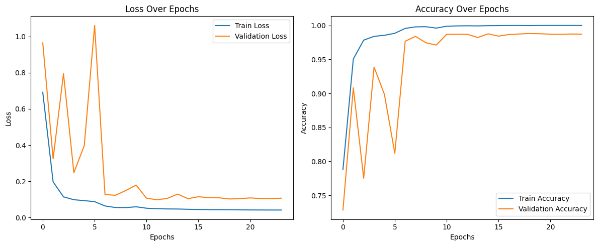
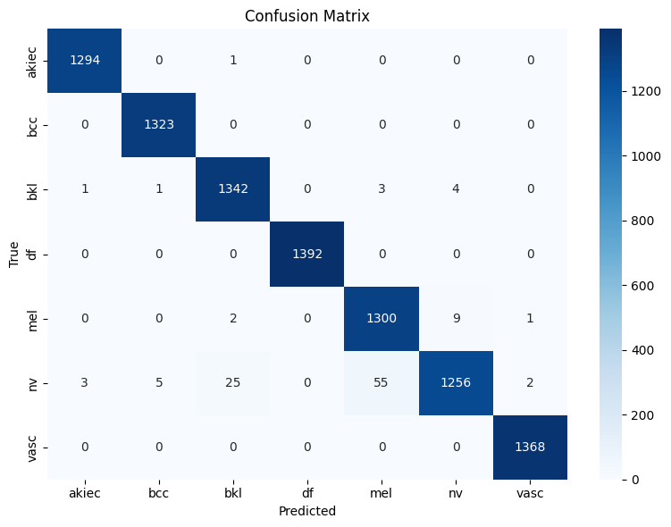
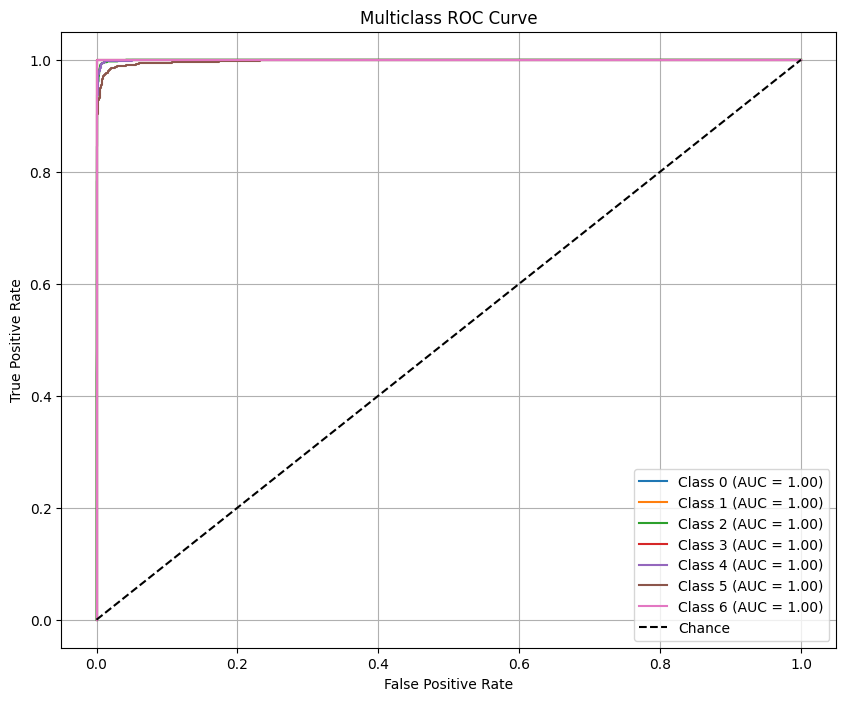

# Hybrid Skin Disease Classifier

This project introduces a powerful deep learning model for classifying skin diseases using dermatoscopic images from the HAM10000 dataset. Accurate diagnosis of skin conditions can be difficult due to visual similarities and limited access to specialists — especially in remote regions. Our solution aims to automate this process using AI.

We developed a hybrid model that fuses three architectures:
- CNN for local feature extraction
- Vision Transformer (ViT) for global attention
- Xception for efficient deep representation learning

To handle the dataset’s class imbalance, we used SMOTE and undersampling techniques, along with data augmentation to improve generalization. Optimization methods like early stopping and learning rate scheduling were applied during training.

This work demonstrates how combining multiple deep learning architectures can produce clinically valuable tools for early skin disease detection.

---

## Results

The final **hybrid model** achieved:

| Metric         | Score       |
|----------------|-------------|
| **Test Accuracy** | 99.53%      |
| **AUC Score**     | 1.00 (All Classes) |
| **F1-Score**      | 0.995+     |

#### Training vs Validation Accuracy & Loss Curves


#### Confusion Matrix


#### ROC Curves for Each Class


---

## Team Members

- [Fatimah Alsaihati]() 
- [Razan Almadan](https://www.linkedin.com/in/razan-almadn-987480276?utm_source=share&utm_campaign=share_via&utm_content=profile&utm_medium=android_app)  
- [Sarah Alshaikhmohamed](https://www.linkedin.com/in/sarah-alshaikhmohamed-ab20a9252?utm_source=share&utm_campaign=share_via&utm_content=profile&utm_medium=ios_app)  
- [Maram Almomen]()  
- [Walaa Alhuwaider]()  
- [Zainab Al Mousa]() 

Instructor: Dr. Wadha Al Mattar

---

## How to Run

1. Clone the repo:
   ```bash
   git clone https://github.com/YOUR_USERNAME/hybrid-skin-disease-classifier.git
   ```
   ```bash
   cd hybrid-skin-disease-classifier
   ```

2. Install dependencies:
    ```bash
    pip install -r requirements.txt
    ```

3. Download the dataset:
    - Visit HAM10000 on Kaggle
    - Place the images in data/HAM10000_images/ and the CSV in data/

4. Run the final notebook:
    ```bash
    jupyter notebook notebooks/hybrid_final.ipynb
    ```

---

## References

- [HAM10000 Dataset](https://www.kaggle.com/datasets/kmader/skin-cancer-mnist-ham10000)
- [Xception-ViT Notebook](https://www.kaggle.com/code/mhamedabid/abid-mhamed-ham-10000-smote)
- [CNN Model Notebook](https://www.kaggle.com/code/irvannurfauzan/skin-cancer-model)
